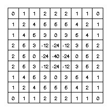
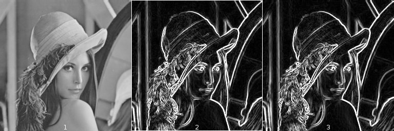
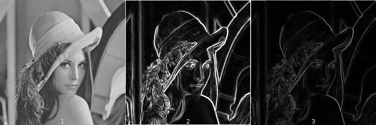
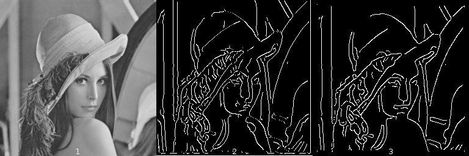
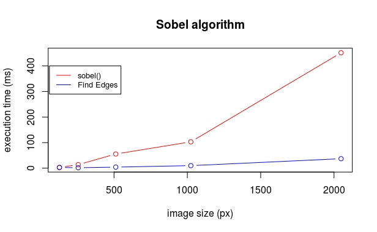
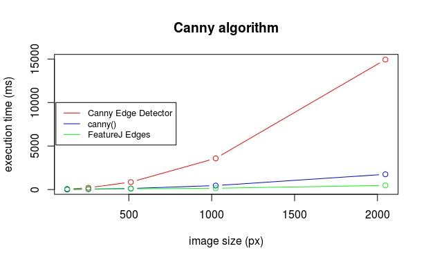

# Edge detection

Authors : Peter Bock\*, Cécilia Ostertag, Ophélie Thierry

## Introduction

Image processing is one of the most important fields in the domain of computer vision[^BOV2009]. Most scientific domains use information extracted from images in one way or another. For a computer to make sense of these images, and be able to extract meaningful data from them, it needs to be able to interprete and understand them.
That is where Image Processing comes in, allowing a computer to process an image and detect its major features, and to perform higher-level vision tasks like face recognition.
In our project, we will examine one specific field of image processing called edge detection.

The physical notion of edge comes from the shape of three dimensional objects or from their material properties. But, seeing as the acquisition process translates 3D scenes to 2D representations, this definition does not apply to image processing. In this report we will use the following definition by Bovik[^BOV2009] (2009): "An edge can generally be defined as a boundary or contour that separates adjacent image regions having relatively distinct characteristics according to some features of interest. Most often this feature is gray level or luminance”. According to this definition, the pixels of an image belonging to an edge are the pixels located in regions of abrupt gray level changes. Moreover, to avoid counting noise pixels as edges, the pixels have to be part of a contour-like structure.
Edge detection is the process of finding the pixels belonging to the edges in an image, and producing a binary image showing the locations of the edge pixels.

In our project, we began by documenting the main linear edge detection approaches and algorithms, and their implementation in the image processing software ImageJ[^SCH2015]:

* Convolution with edge templates (Prewit[^PRE1970], Sobel[^SOB1968], Kirsch[^KIR1971], Robert's Cross[^ROB1963])
* Zero-crossings of Laplacian of Gaussian convolution[^MAR1980]
* Zero-crossings of directional derivatives of smoothed images (Canny[^CAN1986])

We then performed a benchmark on the ImageJ plugins, in order to compare their execution time and the memory load for the Java Virtual Machine (JVM).


For this second part of our project, we have chosen to make our own implementations of the Sobel, Canny and Laplacian of Gaussian Operators using ECMAscript6[^ECMA2011].


**Our report ( written using the markdown format), and associated files, is stored in a repository on github:**
https://github.com/bockp/Edge-Detection-project


## Material & Methods

*Describe in detail for each function the algorithm used in the implementation. Add a diagram or pseudo-code if necessary. This section is very important because it must help the reading of the source code.*

### Utility functions :

# convolve

# gradient

# normalizeConvResult

# logKernel

#  gaussianKernel()

# *theta4directions()*, 

# *nonmax()*

#*hysteresis()*


Two of these functions, *gaussianKernel()* and *convolve()* were coded by us because we needed them for the edge detection functions, but should be replaced by the functions coded by the “Filters” group in the final TIJ application, so they were not optimized here.

### Principal functions

All of our principal functions take as first parameter the raster containing the pixels values of an image, and output a modified raster. They all work with uint8, uint16, and float32 images. To avoid using FOR loops as much as possible they were replaced by the use of Ecmascript *map* and *forEach* functions. Also to avoid accumulating IF… ELSE conditional statements, they were replaced when possible  the use of the ternary operator and compacted with the use of OR and AND logical operators.

### Edge detection using Sobel, Prewitt, and Robert’s cross operators :

The three following algorithm work following the same two steps :
- Convolving the image with the horizontal and vertical kernels to approximate respectively the horizontal (Gx) and vertical (Gy) derivative of the image
- Computing the gradient magnitude using Gx and Gy with the following formula : FORMULA
The result is an image in which the edges have high pixel values compared to the rest of the image.  The only difference is the kernels used by each algorithm : KERNELS
Those kernels are defined as global variables in the beginning of our script. Robert’s cross kernels are 2x2 so they have to be padded with zeros to be used in our *convolve()* function.

The three functions *sobel()*, *prewitt()* and *robertscross()* use the utility functions *convolve()*, *gradient()*, and *normalizeConvResult()* described previously.  To display the image, the lowest and highest values are capped to those allowed by the type of the original image. The following pseudo-code sums up our implementation :

```
Gx = convolve (raster, horizontal kernel)
Gy = convolve (raster, vertical kernel)
gradient = sqrt(Gx²+Gy²)
FOR pixel value IN gradient :
	IF pixel value < lowest value allowed by image type
		pixel value = lowest value
	ELSE IF pixel value > highest value allowed by image type
		pixel value = highest value
	ELSE
		do nothing
	END IF
END FOR
RETURN gradient
```

### Implementation of the Laplacian of Gaussian Operator :

The Laplacian of Gaussian (LoG) algorithm we've chosen to implement is composed of these general steps:

- Generation of a LoG kernel of size 9 using the following formula:


**Fig.?: Mathematical formula of the LoG kernel, created by combining the Laplacian kernel formula with the Gaussian kernel formula.**



**Fig.?: Discrete representation of the 9X9 LoG kernel.**

- Convolution of the image with the given LoG kernel.

- Thresholding of the output by 0 to get a binary image.

- Zero-crossing detection to improve the edge detection.

including optimization to detect as zero-crossing only the foreground pixels with at least one background pixel neighbour.

The Laplacian of Gaussian takes as arguments the raster containing the image pixels, the LoG kernel size and the standard deviation (sigma) value for the LoG kernel generation.

The output is a uint8 binary image in which the edge pixels have the highest pixel value (white) and the other have the lowest value (black).

This function uses the utility functions *convolve()* and *logKernel()*.

The following pseudo-code sums-up our implementation :
```
Output = copy image pixel values from image raster
Set output type to uint8
Initialize output.pixelData as a Uint8ClampedArray of the same length as the raster, to store result of the function in
W = raster's width

ker = create a LoG kernel using logLernel(wanted kernel size, standard deviation/sigma value for Gaussian)
log_data = convolve raster using the generated Ker kernel

Threshold the image

FOR pixel_value IN log_data:
	IF pixel_value >= 0:
		pixel_value = 0
	ELSE:
		pixel_value = 255
END FOR
Store result in thr_img

zero_cross = []

FOREACH pixel_value and integer_counter IN thr_img:
  	IF thr_img[integer_counter] is foreground (255) 	 AND has at least one Background (0) neighbour:
			 Add a 255 to Zero_cross, as this is a zero-crossing.
		ELSE:
			 Add a 0 to Zero_cross.
END FOREACH

Set output.pixelData to contain Zero_cross


RETURN output
```

### Edge detection using Canny’s algorithm :

Canny’s algorithm uses the following steps:
- Noise reduction by convolving the image with a Gaussian filter of a given standard deviation
- Computation of the intensity gradient magnitude and orientation using the following formulas : FORMULAS
- Dividing orientation values (theta) into 4 directions : horizontal (0°), north-east /south-west(45°), vertical (90°), and north-west/south-east direction (135°)
- Non-maximum suppression by only keeping pixels which value is the maximum compared to the values of the two surrounding pixels according to the gradient orientation (SCHEMA)
- Finding strong edge pixels and weak edge pixels using a low and a high threshold values
- Tracing edges with hysteresis, by keeping weak edge pixels next to strong edge pixels and then extending the edges in several passes (see figure ??? in Annex)

The *canny()* function takes as parameter the raster containing the pixels of the image, the low and high threshold for the hysteresis (in the range 0 to 255), and the standard deviation value for the Gaussian filter. The output is a uint8 binary image in which the edge pixels have the highest pixel value (white) and the other have the lowest value (black). This function uses the utility functions *convolve()*, *gaussianKernel()*, *normalizeConvResult()*, *theta4directions()*, *nonmax()*, and *hysteresis()*. The following pseudo-code sums-up our implementation :

```
IF image type = uint16
	multiply low and high threshold by 256
ELSE IF image type = float32
	divide low and high threshold by 128 and substract 1
ELSE IF image type = uint8
	do nothing
END IF
data = convolve(raster, Gaussian Kernel of size 9 and standard deviation sigma)
put data in raster
Gx = convolve(raster, horizontal Sobel kernel)
Gy = convolve(raster, vertical Sobel kernel)
gradient = sqrt(Gx²+Gy²)
theta = atan2(Gx,Gy)
theta = theta4directions(theta)
newGradient = []
FOR pixel value in gradient
	IF pixel is at the border of the pixel OR  pixel value <= surrounding pixels values in gradient direction
		push lowest pixel value to newGradient
	ELSE
		push current gradient value to newGradient
	END IF
END FOR
strong_edges = []
FOR value in newGradient
	IF value > high threshold
		add 255 to strong_edges
	ELSE
		add 0 to strong_edges
	END IF
END FOR
thresholded_edges = []
FOR value in newGradient
	IF value > high thresholded
		push 2 to thresholded_edges
	ELSE IF value > low_threshold
		push 1 to thresholded_edges
	ELSE
		push 0 to thresholded_edges
	END IF
END FOR
edges = strong_edges
chosen_pixels = []
FOR i IN range(length(edges))
	IF thresholded_edges[i] = 1 AND thresholded_edges[any surrounding pixel in 8-connectivity] = 2
		push i to chosen_pixels
		edges[i]=255
	END IF
END FOR
WHILE length(chosen_pixels) > 0
	new_pixels = []
	FOR i IN chosen_pixels
		IF thresholded_edges[any pixel surrounding ith pixel in 8-connectivity] = 1 AND edges[corresponding pixel] = 0
			push corresponding pixel index to new_pixels
			edges[corresponding pixel]=255
		END IF
	END FOR
	chosen_pixels = new_pixels
END WHILE
RETURN edges
```

### Benchmarking process

The benchmark was done using a computer with an Intel core I7 @4.0 Ghz, on Linux Ubuntu 16.04 64 bits with a kernel 4.10. The version of ImageJ is the 1.51q, using Java 1.8.0\_112 (64 bits). We fixed the choice of processor with the taskset command to avoid a sharing of the processor load, and finally we fixed the ImageJ process with a high priority to avoid preemption.

For this benchmark, we used the same picture (Lena, 8bit), in five different sizes : 128x128 px, 256x256 px, 512x512 px, 1024x1024 px, and 2048x2048 px, to show how the performance of our functions vary when increasing the complexity of the input image. We performed this benchmark on our functions as well as the functions available in ImageJ described in the previous report. For the implementation of the benchmarks see the files *benchmark.js* for the ImageJ functions, and *benchmarkForTiji.js* for our functions, in our GitHub repository. 

## Results

*TODO benchmark for uint16 and float32 on our functions*

### Edge detection using Sobel, Prewitt, and Robert’s cross operators

The two pictures below show the result given by ImageJ’s function FindEdges which uses Sobel operator, and our *sobel()* function. We can see that we obtain quite similar results [Fig.?]



**Fig.?: Result of Sobel filtering. 1:original image, 2:output of our function, 3:output of ImageJ Find Edges**


The two following pictures show the result of edge detection using our *prewitt()* and *robertscross()* function [Fig.?]. 



**Fig.?: Result of Prewitt and Robert’s cross filtering. 1:original image, 2:output of our prewitt() function, 3:output of our robertscross() functions**

### Edge detection using the Laplacian of Gaussian algorithm:

The 4 pictures below show the results of applying the FeatureJ Laplacian to the Lena 8bit image, and compares it to the results obtained using our own implementation.


**Fig.?: (1) original Lena 8bit image, (2) FeatureJ simple LaPlacian using Smoothing = 3, (3) FeatureJ simple LaPlacian using Smoothing = 5, (4) TIJ LoG with sigma = 2**

As can be seen, LoG, the combination of the Laplacian kernel with the Gaussian, leads to much better results than a simple LaPlacian kernel, as used by FeatureJ.

The 3 images below compare the ImageJ plugin Mexican Hat, which uses a LoG algorithm with a circular kernel whose radius can be defined, to our own TIJ Ecmascript implementation:


**Fig.?: (1) Lena 8bit image, (2) Mexican Hat/LoG filter with radius = 5, (3) TIJ LoG filter with Sigma = 2**

As can be seen, A Mexican Hat filter with radius 5 gives a similar result to our TIJ implementation with a sigma of 2, but we cannot truly compare the two, given one uses a circular kernel, and the other a rectangular one.

Taking that into account, we can at least see that the results are comparable in quality.

### Edge detection using Canny’s algorithm :

The following figure represents the result of the *canny()* function with parameters low threshold = 15.0, high threshold = 30.0, and sigma = 2.0. (REF) , compared with the result given by the plugin Canny Edge Detector with parameters low threshold = 2.5, high threshold = 5.0, and sigma = 2.0 [Fig.?]. The results are similar but the threshold values do not have the same effect for the detection of edges. Nonetheless, we can see that the edges of the face, hat and shoulder are well detected, as well as some details on the hat feathers. There are false edges at the bottom and right side of the picture, due to the Gaussian filtering step. Onces this function is replaced by the one coded by the “Filters” group it should give the expected result.  



**Fig.?: Result of Canny filtering. 1:original image, 2:output of our function, 3:output of ImageJ Canny Edge Detector plugin**


### Benchmark results

The result of our benchmark for all of our functions ([Fig.?]) show us the result that we expected : the *sobel()*, *prewitt()* and *robertscross()* functions are the fastest and have an almost identical execution time, then the *LoG()* , and finally the *canny()* function. All the functions take more execution time as the image gets bigger. We can also see that the differences between these three groups are widening as we increase the size of the input image : the results are similar for sizes of 128x128, 256x256 and 512x512 pixels, but for pictures of size 1024x1024 and 2048x2048 the LoG implementation takes twice the time of Sobel, Prewitt and Robert’s cross, and the Canny implementation takes three times the execution time. This result was expected for Canny because its  algorithm works in several passes contrarily to the others.


**Fig.?: Execution time of all of our functions with five increasing image sizes**

We then compared each of our functions with the existing corresponding functions in ImageJ. First, for the Sobel operator we compared our function with the ImageJ function FindEdges ([Fig.?]). We can see that ImageJ’s function hasan execution time almost constant for all image sizes. With a picture of 2048x2048 pixels, the execution time of our function is more than ten times higher than the Find Edges function. This is due to the fact that the complexity of our function is *n²* because of the convolution step, while ImageJ’s function uses an optimized version of the convolution.



**Fig.?: Execution time of all of our *sobel()* function and ImageJ FindEdges function, with five increasing image sizes**

For the LoG operator, we compared our function with the plugins Log_Filter by ??? and FeatureJ Laplace by ??? ([Fig.?]). Here we can see that our function outperforms FeatureJ’s for sizes up to 512x512 pixels, but is two times slower for 1024x1024 px images, and three times slower for 2048x2048 px images.


**Fig.?: Execution time of all of our *LoG()* function and ImageJ Log_Filter and FeatureJ Laplace plugins, with five increasing image sizes**

Finally, for Canny algorithm, we compared our function with the plugins Canny Edge Detector by ??? and FeatureJ Edges by ??? ([Fig.?]). Our function outperforms the Canny Edge Detector function, which we showed in our previous report was unexpectedly time consuming.  For sizes up to 512x512 px, our function has a lower execution time than FeatureJ’s, for 1024x1024 px images, it takes twice the time, and is more than three times slower for 2048x2048 px images.


**Fig.?: Execution time of all of our *canny()* function and ImageJCanny Edge Detector and FeatureJ Edges plugins, with five increasing image sizes**

## Discussion

*Comparison of your implementation with those of ImageJ. Is it faster, better, less memory consuming, ...?*

### Qualitative Comparison

same results for sobel, we cannot compare for prewitt and roberts, for LoG the implemenation is different(thresholding) so not the same visual results but edges are well identifies as well as details, for canny the thresholds give different results when used on our function and on imageJ, but we can have similar results although the contours are more erratic than those given by ImageJ's functions

### Performance Comparison

our functions can handle the processing of pictures up to 2048x2048 px, maybe higher, they can use uint8, uint16 and float32 images

our functions are slow but it was expected, the time ups when the size is incresed (expected also), this is due to the convolutions, and for canny algorithm to the fact that several passes are necessay to elongate (is this a word ??) the edges 

## Conclusion

Using JavaScript, we implemented the most used edge detection algorithm for images, that can be executed on any web navigator. These functions give results similar to those obtained with the use of ImageJ. However it was expected that our functions would be outperformed by ImageJ’s and plugins, because they are coded in Java which is a more powerful language than JavaScript. 

To achieve better performance, we will use the WebGL JavaScript API to use the GPU instead of the CPU and have faster execution times thanks to its parallel architecture.


*TOUTES les citations doivent etre utilise*


[^ECMA2011]: ECMAScript EC. European Computer Manufacturers Association and others. ECMAScript language specification. 2011.

[^ROB1963]: Roberts LG. Machine perception of three-dimensional solids (Doctoral dissertation, Massachusetts Institute of Technology).

[^ABD2015]: Abdelsamea MM, Gnecco G, Gaber MM, Elyan E. On the relationship between variational level set-based and som-based active contours. Computational intelligence and neuroscience. 2015 Jan 1;2015:34.

[^BOV2009]: Bovik AC, editor. The essential guide to image processing. Academic Press; 2009 Jul 8.

[^CAN1986]: Canny J. A computational approach to edge detection. IEEE Transactions on pattern analysis and machine intelligence. 1986 Nov(6):679-98.

[^CHAA2014]: Chaabane SB, Fnaiech F. Color edges extraction using statistical features and automatic threshold technique: application to the breast cancer cells. Biomedical engineering online. 2014 Jan 23;13(1):4.

[^CHO2016]: Choudhry P. High-Throughput Method for Automated Colony and Cell Counting by Digital Image Analysis Based on Edge Detection. PLoS One. 2016; 11(2): e0148469.

[^DAV1975]: Davis LS. A survey of edge detection techniques. Computer graphics and image processing. 1975 Sep 1;4(3):248-70.

[^DER1987]: Deriche R. Using Canny's criteria to derive a recursively implemented optimal edge detector. International journal of computer vision. 1987 Jun 1;1(2):167-87.

[^DIN2001]: Ding L, Goshtasby A. On the Canny edge detector. Pattern Recognition. 2001 Mar 31;34(3):721-5.

[^GRE2016]: Grega M, Matiolanski A, Leszczuk M. Automated Detection of Firearms and Knives in a CCTV Image. Sensors 2016, 16, 47; doi:10.3390/s16010047.

[^HAQ2015]: Haq I, Anwar S, Shah K, Khan MT, Shah SA. Fuzzy Logic Based Edge Detection in Smooth and Noisy Clinical Images. PLoS One. 10(9):e0138712, 2015.

[^JAL2017]: Jalalian A, Mashohor S, Mahmud R, Karasfi B, Saripan MIB, Ramli ARB. Foundation and Methodologies in computer-aided diagnosis systems for breast cancer detection. EXCLI Journal, 16:113-137, 2017.

[^KEK2010]: Kekre HB, Gharge SM. Image segmentation using extended edge operator for mammographic images. International journal on computer science and Engineering. 2010;2(4):1086-91.

[^KIR1971]: Kirsch RA. Computer determination of the constituent structure of biological images. Computers and biomedical research. 1971 Jun 1;4(3):315-28.

[^LUO2017]: Luo S, Yang J, Gao Q, Zhou S, Zhan CA. The Edge Detectors Suitable for Retinal OCT Image Segmentation. Journal of Healthcare Engineering 2017; 2017: 3978410.

[^MAI2009]: Maini R, Aggarwal H. Study and comparison of various image edge detection techniques. International journal of image processing (IJIP). 2009 Jan;3(1):1-1.

[^MAR1980]: Marr D, Hildreth E. Theory of edge detection. Proceedings of the Royal Society of London B: Biological Sciences. 1980 Feb 29;207(1167):187-217.

[^PRE1970]: Prewitt JM. Object enhancement and extraction. Picture processing and Psychopictorics. 1970 Jan 1;10(1):15-9.

[^RIC1945]: Rice SO. Mathematical analysis of random noise. The Bell System Technical Journal. 1945 Jan;24(1):46-156.

[^SCH1997]: Scharcanski J and Venetsanopoulos A.N. Edge detection of color images using directional operators. IEEE Trans. Circuits Syst. Video Technol., 7(2):397–401, 1997.

[^SCH2015]: Schindelin J, Rueden CT, Hiner MC, Eliceiri KW. The ImageJ ecosystem: An open platform for biomedical image analysis. Molecular reproduction and development. 2015 Jul 1;82(7-8):518-29.

[^SOB1968]: Sobel I. An isotropic 3× 3 image gradient operator, presentation at Stanford Artificial Intelligence Project (SAIL).
